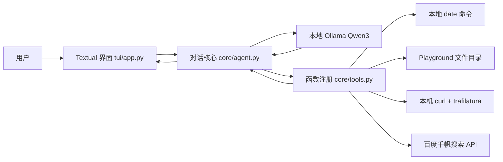

# 星芽架构图

由 AI 根据本项目 `core` 与 `tui` 代码生成；可复制到 https://mermaid.live 编辑。

```mermaid
flowchart LR
    U[用户] --> T[Textual 界面 tui/app.py]
    T --> A[对话核心 core/agent.py]
    A --> O[本地 Ollama Qwen3]
    O --> A
    A --> F[函数注册 core/tools.py]
    F --> D[本地 date 命令]
    F --> P[Playground 文件目录]
    F --> C[本机 curl + trafilatura]
    F --> B[百度千帆搜索 API]
    F --> A
    A --> T
```

界面负责输入、显示和状态；核心负责流式响应、工具调用和聊天历史；工具层包含 15 个函数。
